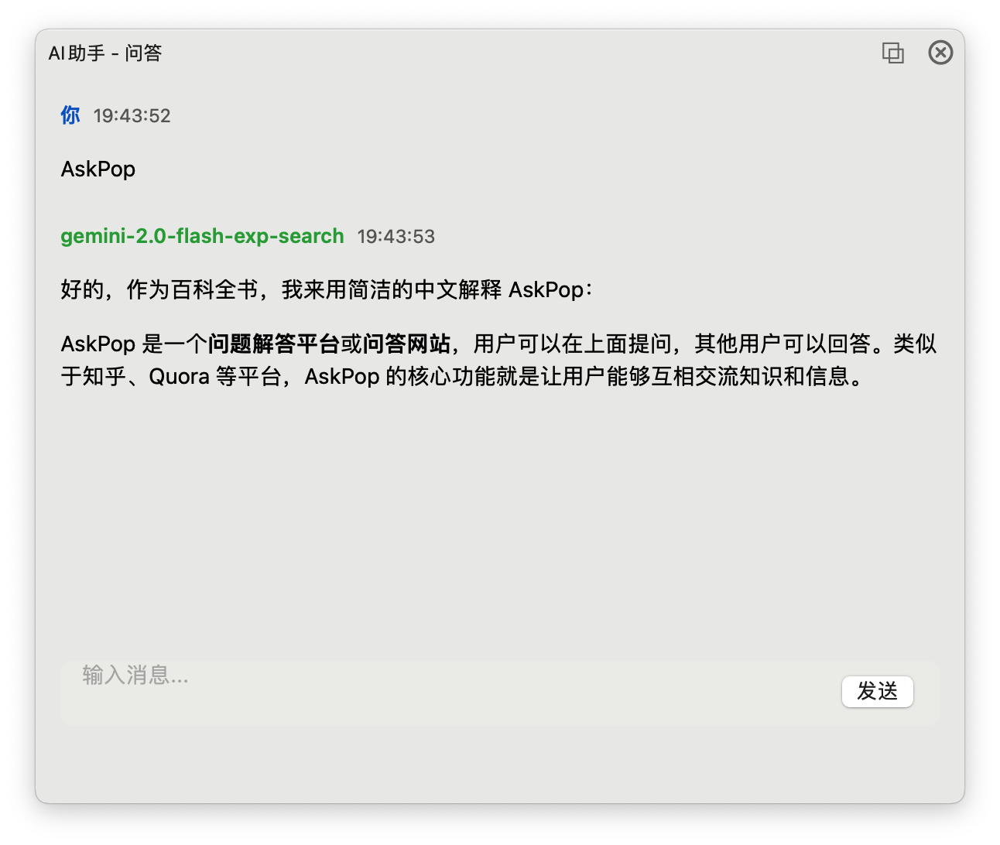
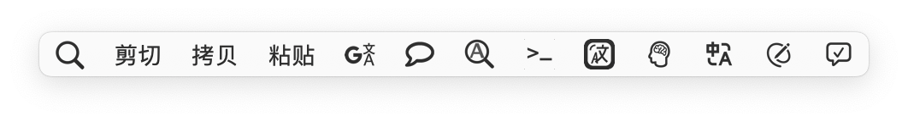

# AskPop - PopClip AI 助手

AskPop 是一个 PopClip 扩展，让你可以快速使用 AI 功能处理选中的文本。支持问答和翻译功能，可以配置使用不同的 AI 服务商。



## 功能特点

- 🤖 **AI 问答**：选中文本后快速获取 AI 解答
- 🌐 **智能翻译**：自动识别中英文，进行互译
- ✍️ **文本改写**：优化文本表达，提升专业度
- ✅ **语法检查**：自动检查并修正英文语法错误
- 💬 **实时响应**：流式输出，即时查看 AI 回复
- 🎨 **优雅界面**：简洁美观的浮动窗口
- ⚙️ **灵活配置**：支持自定义 API、模型和参数



## 安装要求

- macOS 13.0 或更高版本
- PopClip 4022 或更高版本
- Intel 或 Apple Silicon Mac

## 快速开始

1. 下载 [AskPop.zip](https://github.com/xinbs/AskPop/raw/main/AskPop.zip) 并解压
2. 双击 `AskPop.popclipext` 安装扩展
3. 在 PopClip 设置中配置 API Key 和其他选项
4. 用编辑器打开rewrite.grammar.js，鼠标从顶部往下拉，选中所有文本，Popclip 会提示安装

5. 在 PopClip 设置中配置 API Key 和其他选项
6. 选中文本，点击工具栏图标即可使用

## 配置说明

### 基础配置

- **API Key**: 你的 AI 服务商 API 密钥
- **API URL**: API 接口地址
- **AI 模型**: 使用的模型名称
- **温度**: 回复的随机性 (0.0-1.0)

### 提示词配置

- **问答提示词**: 自定义 AI 问答的系统提示词
- **翻译提示词**: 自定义翻译的系统提示词

## 使用方法

1. **AI 问答**
   - 选中要询问的文本
   - 点击工具栏中的 "问" 图标
   - 在弹出窗口中查看 AI 回答

2. **文本翻译**
   - 选中要翻译的文本
   - 点击工具栏中的 "译" 图标
   - 自动识别语言并翻译

3. **文本改写**
   - 选中要改写的文本
   - 点击工具栏中的 "改写" 图标
   - 获取更专业的表达方式

4. **语法检查**
   - 选中英文文本
   - 点击工具栏中的 "语法" 图标
   - 自动检查并修正语法错误

## 支持的 AI 服务商

- OpenAI (默认)
- 其他兼容 OpenAI API 格式的服务商

## 开发说明

项目使用 Swift 开发，主要文件结构：

```
AskPop/
├── src/                    # Swift 源代码
├── Extension/              # PopClip 扩展配置
│   ├── Config.plist       # 扩展配置文件
│   ├── rewrite.grammar.js # 改写和语法检查功能
│   └── run.sh            # 启动脚本
├── screenshots/           # 截图文件
├── .gitignore            # Git 忽略配置
└── Package.swift         # Swift 包配置
```

### JavaScript 扩展功能

除了主要的 Swift 实现外，改写和语法检查功能使用 JavaScript 实现：

```javascript
// 文本改写
rewrite: {
    title: "改写",
    icon: "symbol:pencil.and.outline",
    after: "preview-result"
}

// 语法检查
grammar: {
    title: "语法检查",
    icon: "symbol:checkmark.bubble",
    after: "preview-result"
}
```

这些功能：
- 使用相同的 API 配置
- 支持实时预览结果
- 自动复制修改后的文本
- 显示操作完成提示

## 系统要求

- macOS 10.15 或更高版本
- Intel 处理器的 Mac
- PopClip 已安装

## 开发者安装

如果你想自己编译和开发这个扩展：

1. 克隆此仓库
   ```bash
   git clone https://github.com/xinbs/AskPop.git
   cd AskPop
   ```

2. 运行打包脚本
   ```bash
   ./package.sh
   ```

3. 打包脚本会：
   - 编译 Swift 源代码
   - 创建 PopClip 扩展
   - 生成发布包 AskPop.zip

4. 开发建议：
   - 修改 Config.plist 配置扩展选项
   - 编辑 rewrite.grammar.js 调整改写功能
   - 更新 main.swift 开发新功能

5. 调试方法：
   - 查看日志: `/tmp/popclip_ai_tool.log`
   - 使用 `print()` 输出调试信息
   - 在 PopClip 设置中启用调试模式

## 注意事项

- 请确保有可用的网络连接
- API 调用可能产生费用，请查看相应服务商的计费规则
- 首次使用需要设置 API 密钥

## 许可证

MIT License 